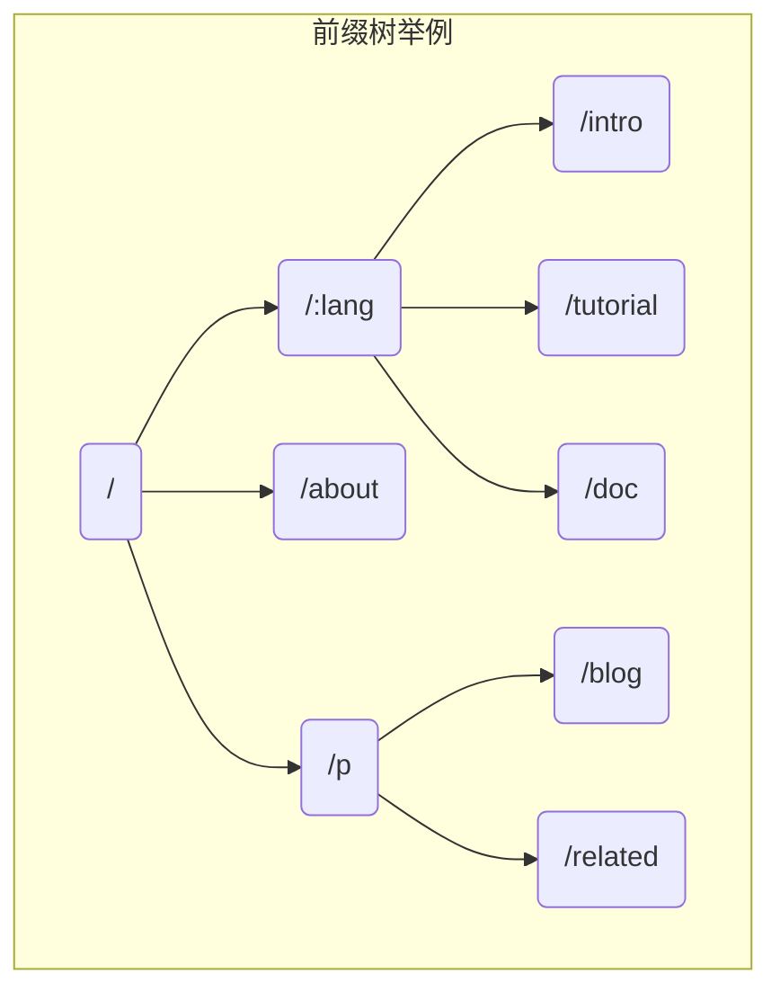

# 序言
在设计一个框架之前，需要明白框架核心为我们解决了什么问题，这样才能想明白需要在框架中实现什么功能。
golang的标准库`net/http`提供了简单的Web功能，即监听端口、映射动态路由、解析HTTP报文。一些web开发中简单的需求并不支持，需要自行实现。
# HTTP基础
## 标准库 net/http 的使用（标准库启动Web服务）
通过例子理解标准库`net/http`的使用
```go
package main

import (
	"fmt"
	"log"
	"net/http"
)

func main() {
	http.HandleFunc("/", indexHandler)
	http.HandleFunc("/Hello", helloHandler)
	log.Fatal(http.ListenAndServe(":9999", nil))
}

// handler echoes r.URL.Path
func indexHandler(w http.ResponseWriter, req *http.Request) {
}

// handler echoes r.URL.Header
func helloHandler(w http.ResponseWriter, req *http.Request) {
	for k, v := range req.Header {
		fmt.Fprintf(w, "Header[%q] = %q\n", k, v)
	}
}
```
- 代码中设置了两个路由`/`和`/Hello`，分别绑定 *indexHandler* 和 *helloHandler*，根据不同的http请求调用不同的处理函数。
  - 访问`/`，响应是`URL.Path = /`
  - 访问`/Hello`，响应是请求头（Header）中的键值对信息。
- `main`函数的最后一行`log.Fatal(http.ListenAndServe(":9999", nil)`用于启动Web服务。
  - 第一个参数是地址，`:9999`表示在 *9999* 端口监听。
  - 第二个参数代表处理所有的HTTP请求的实例，`nil`代表使用标准库中的实例处理。第二个参数是基于`net/http`标准库实现Web框架的入口。

## 实现http.Handler接口
```go
package http

type Handler interface {
	ServeHTTP(w ResponseWriter, r *Request)
}

func ListenAndServe(address string, h Handler) error
```
第二个参数的类型是什么呢？通过查看`net/http`的源码可以发现，Handler是一个接口，需要实现方法 *ServeHTTP* ，也就是说，只要传入任何实现了 *ServerHTTP* 接口的实例，所有的HTTP请求，就都交给了该实例处理了。
```go
package main

import (
	"fmt"
	"log"
	"net/http"
)

// Engine is the uni handler for all requests
type Engine struct{}

func (engine *Engine) ServeHTTP(w http.ResponseWriter, req *http.Request) {
	switch req.URL.Path {
	case "/": // handler echoes r.URL.Path
		fmt.Fprintf(w, "URL.Path = %q\n", req.URL.Path)
	case "/hello": // handler echoes r.URL.Header
		for k, v := range req.Header {
			fmt.Fprintf(w, "Header[%q] = %q\n", k, v)
		}
	default:
		fmt.Fprintf(w, "404 NOT FOUND: %s\n", req.URL)
	}
}

func main() {
	engine := new(Engine)
	log.Fatal(http.ListenAndServe(":9999", engine))
}
```
- 用`switch...case...`把分开写的两个路由整合到了一起
- 定义一个空结构体`Engine`，实现了方法`ServeHTTP`。
  - 这个方法有2个参数，第一个参数是 *ResponseWriter* ，利用 *ResponseWriter* 可以构造针对该请求的响应；第二个参数是 *Request* ，该对象包含了该HTTP请求的所有的信息，比如请求地址、Header和Body等信息。
- 在 `main` 函数中，我们给 *ListenAndServe* 方法的第二个参数传入了刚才创建的`engine`实例。
  至此，我们走出了实现Web框架的第一步，即，将所有的HTTP请求转向了我们自己的处理逻辑。
  在实现`Engine`之前，我们调用 *http.HandleFunc* 实现了路由和Handler的映射，也就是只能针对具体的路由写处理逻辑。比如`/hello`。但是在实现`Engine`之后，我们拦截了所有的HTTP请求，拥有了统一的控制入口。在这里我们可以自由定义路由映射的规则，也可以统一添加一些处理逻辑，例如日志、异常处理等。
- 代码的运行结果与之前的是一致的。
## Gee框架的雏形
重新组织上面的代码，搭建出整个框架的雏形
最终的代码目录结构：
```txt
gee/
  |--gee.go
  |--go.mod
main.go
go.mod
```
Gee框架的雏形实现了路由映射表，提供了用户注册静态路由的方法，包装了启动服务的函数
### go.mod
创建`go.mod`文件，在`go.mod`中使用`replace`将 gee 指向 `./gee`
```txt
module example

go 1.20.2

require gee v0.0.0

replace gee => ./gee
```
### main.go
打开`main.go`文件，写入以下代码：
使用`New()`创建 gee 的实例，使用 `GET()`方法添加路由，最后使用`Run()`启动Web服务。这里的路由，只是静态路由，不支持`/hello/:name`这样的动态路由
```go
package main

import (
	"fmt"
	"net/http"
	"gee"
)

func main() {
	r := gee.New()
	r.GET("/", func(w http.ResponseWriter, req *http.Request) {
		fmt.Fprintf(w, "URL.Path = %q\n", req.URL.Path)
	})

	r.GET("/hello", func(w http.ResponseWriter, req *http.Request) {
		for k, v := range req.Header {
			fmt.Fprintf(w, "Header[%q] = %q\n", k, v)
		}
	})

	r.Run(":9999")
}
```
### gee/gee.go
创建文件夹`gee`，新建文件`gee.go`
```go
type HandlerFunc func(http.ResponseWriter, *http.Request)
```
定义了类型`HandlerFunc`:提供给使用框架的用户，用来定义路由映射的处理方法。
```go
type Engine struct {
	router map[string]HandlerFunc
}
``` 
在`Engine`中添加了一张路由映射表`router`
```go
func (engine *Engine) addRoute(method string, pattern string, handler HandlerFunc) {
	key := method + "-" + pattern
	engine.router[key] = handler
}
``` 
key 由请求方法`methond`和静态路由地址`pattern`构成，如`GET-/`、`POST-/hello`。这样针对相同的路由，如果请求方法不同，可以映射不同的处理方法(Handler)，value 是用户映射的处理方法
```go
func (engine *Engine) GET(pattern string, handler HandlerFunc) {
	engine.addRoute("GET", pattern, handler)
}
``` 
当用户调用`(*Engine).GET()`方法时，会将路由和处理方法注册到映射表 *router* 中
```go
func (engine *Engine) Run(addr string) (err error) {
	return http.ListenAndServe(addr, engine)
}
```
`(*Engine).Run()`方法，是 *ListenAndServe* 的包装
```go
func (engine *Engine) ServeHTTP(w http.ResponseWriter, req *http.Request) {
	key := req.Method + "-" + req.URL.Path
	if handler, ok := engine.router[key]; ok {		// 查到了
		handler(w, req)
	} else {										// 没查到
		fmt.Fprintf(w, "404 NOT FOUND: %s\n", req.URL)
	}
}
``` 
`Engine`实现的 *ServeHTTP* 方法的作用：解析请求的路径，查找路由映射表，如果查到就执行注册的处理方法。如果查不到，就返回 *404 NOT FOUND*
# 上下文 Context
- 将`路由(router)`独立出来，方便之后增强。
- 设计`上下文(Context)`，封装 Request 和 Response ，提供对 JSON、HTML 等返回类型的支持。
## 设计Context
### 必要性
1. 对Web服务来说，无非是根据请求`*http.Request`，构造响应`http.ResponseWriter`。但是这两个对象提供的接口粒度太细，比如要构造一个完整的响应，需要考虑消息头(Header)和消息体(Body)，Header 包含了状态码(StatusCode)，消息类型(ContentType)等几乎每次请求都需要设置的信息，如果不进行有效的封装，那么框架的用户将需要写大量重复，繁杂的代码，而且容易出错
2. 针对使用场景，封装`*http.Request`和`http.ResponseWriter`的方法，简化相关接口的调用，只是设计 Context 的原因之一。对于框架来说，还需要支撑额外的功能。例如，将来解析动态路由`/hello/:name`，参数`:name`的值放在哪呢？再比如，框架需要支持中间件，那中间件产生的信息放在哪呢？Context 随着每一个请求的出现而产生，请求的结束而销毁，和当前请求强相关的信息都应由 Context 承载。因此，设计 Context 结构，扩展性和复杂性留在了内部，而对外简化了接口。路由的处理函数，以及将要实现的中间件，参数都统一使用 Context 实例， Context 就像一次会话的百宝箱，可以找到任何东西。
## 具体实现
### context.go
```go
type H map[string]interface{}
``` 
给`map[string]interface{}`起了一个别名`gee.H`，构建JSON数据时显得更简洁
```go
type Context struct {
	// origin objects
	Writer http.ResponseWriter
	Req    *http.Request
	// request info
	Path   string
	Method string
	// response info
	StatusCode int
}

func newContext(w http.ResponseWriter, req *http.Request) *Context {
	return &Context{
		Writer: w,
		Req:    req,
		Path:   req.URL.Path,
		Method: req.Method,
	}
}
``` 
`Context`目前只包含了`http.ResponseWriter`和`*http.Request`，另外提供了对 Method 和 Path 这两个常用属性的直接访问。
```go
func (c *Context) PostForm(key string) string {
	return c.Req.FormValue(key)
}

func (c *Context) Query(key string) string {
	return c.Req.URL.Query().Get(key)
}
``` 
提供了访问 Query 和 PostForm 参数的方法
```go
func (c *Context) String(code int, format string, values ...interface{}) {
	c.SetHeader("Content-Type", "text/plain")
	c.Status(code)
	c.Writer.Write([]byte(fmt.Sprintf(format, values...)))
}

func (c *Context) JSON(code int, obj interface{}) {
	c.SetHeader("Content-Type", "application/json")
	c.Status(code)
	encoder := json.NewEncoder(c.Writer)
	if err := encoder.Encode(obj); err != nil {
		http.Error(c.Writer, err.Error(), 500)
	}
}

func (c *Context) Data(code int, data []byte) {
	c.Status(code)
	c.Writer.Write(data)
}

func (c *Context) HTML(code int, html string) {
	c.SetHeader("Content-Type", "text/html")
	c.Status(code)
	c.Writer.Write([]byte(html))
}
``` 
提供了快速构造 String/Data/JSON/HTML 响应的方法
### 路由(Router)
一开始，路由是写在`gee.go`里面的，现在将和路由相关的方法和结构提取出来，放到一个新的文件`router.go`中，方便下一次对 router 的功能进行增强，例如提供动态路由的支持。 
```go
func (r *router) handle(c *Context) {
	key := c.Method + "-" + c.Path
	if handler, ok := r.handlers[key]; ok {
		handler(c)
	} else {
		c.String(http.StatusNotFound, "404 NOT FOUND: %s\n", c.Path)
	}
}
``` 
router 的 handler 方法作了一个细微的调整，即 handler 的参数变成了 Context
### 框架入口
#### gee.go
将`router`相关的代码独立后，`gee.go`简单了不少。最重要的还是实现了 ServeHTTP 接口，接管了所有的 HTTP 请求。
```go
func (engine *Engine) ServeHTTP(w http.ResponseWriter, req *http.Request) {
	c := newContext(w, req)
	engine.router.handle(c)
}
``` 
相比之前的代码，这个方法也有细微的调整，在调用 `router.handle` 之前，构造了一个 Context 对象。这个对象目前还非常简单，仅仅是包装了原来的两个参数。
#### main.go
```go
func main() {
	r := gee.New()
	r.GET("/", func(c *gee.Context) {
		c.HTML(http.StatusOK, "<h1>Hello Gee</h1>")		// HTML函数
	})
	r.GET("/hello", func(c *gee.Context) {
		// expect /hello?name=geektutu
		c.String(http.StatusOK, "hello %s, you're at %s\n", c.Query("name"), c.Path)	// String函数
	})

	r.POST("/login", func(c *gee.Context) {
		c.JSON(http.StatusOK, gee.H{				// JSON函数
			"username": c.PostForm("username"),
			"password": c.PostForm("password"),
		})
	})

	r.Run(":9999")
}
``` 
把`Handler`的参数变成成了`gee.Context`，提供了查询Query/PostForm参数的功能。
`gee.Context`封装了`HTML/String/JSON`函数，能够快速构造HTTP响应。
#### test
运行`main.go`，在`cmd`中使用`curl`查看成果：
```go
> curl -i http://localhost:9999/
HTTP/1.1 200 OK
Date: Mon, 12 Aug 2019 16:52:52 GMT
Content-Length: 18
Content-Type: text/html; charset=utf-8
<h1>Hello Gee</h1>

> curl "http://localhost:9999/hello?name=geektutu"
hello geektutu, you're at /hello

> curl "http://localhost:9999/login" -X POST -d "username=geektutu&password=1234"
{"password":"1234","username":"geektutu"}

> curl "http://localhost:9999/xxx"
404 NOT FOUND: /xxx
```
# 前缀树路由
使用 Trie 树实现动态路由(dynamic route)解析
支持两种模式`:name`和`*filepath`
## Trie 树简介
之前的代码中使用了`map`结构存储路由表键值对，这样的索引很高效，但它只能索引静态路由，无法索引动态路由。
**动态路由：** 一条路由规则可以匹配某一类型，而非某一条固定的路由。例如`/hello/name`可以匹配到`/hello/geektutu`、`/hello/jack`等。
动态路由有很多种实现方式，支持的规则、性能等有很大的差异。
**前缀树（Trie 树）** 实现动态路由最常用的数据结构。每一个节点的所有的子节点都拥有相同的前缀。这种结构非常适用于路由匹配。

HTTP请求的路径是由`/`分隔的多端构成的，因此，每一段可以作为前缀树的一个节点。
通过树结构进行查询，如果中间某一层的节点都不满足条件，说明没有匹配到的路由，查询结束。

接下来实现的动态路由具备以下两个功能。
1. 参数匹配`:`。例如 `/p/:lang/doc`，可以匹配 `/p/c/doc` 和 `/p/go/doc`。
2. 通配`*`。例如 `/static/*filepath`，可以匹配`/static/fav.ico`，也可以匹配`/static/js/jQuery.js`，这种模式常用于静态服务器，能够递归地匹配子路径。

## Trie 树实现
首先要清楚树节点上应该储存哪些信息。
```go
type node struct {
	pattern  string  // 待匹配的路由，如 /p/:lang
	part     string  // 路由中的一部分，如 :lang
	children []*node // 子节点，例如 [doc, tutorial, intro]
	isWild   bool    // 是否精确匹配，part 含有冒号(:)或星号(*)时为 true
}
```
为了实现动态路由匹配，加上了`isWild`这个参数。
`isWild`用法举例：想匹配 `/p/go/doc/`这个路由时，第一层节点中，`p`精准匹配到`p`，第二层节点中，`:lang`模糊匹配到`go`，则会把`lang`这个参数赋值为`go`，继续下一层匹配。 
```go
// 第一个匹配成功的节点，用于插入
func (n *node) matchChild(part string) *node {
	for _, child := range n.children {
		if child.part == part || child.isWild {
			return child
		}
	}
	return nil
}

// 所有匹配成功的节点，用于查找
func (n *node) matchChildren(part string) []*node {
	nodes := make([]*node, 0)
	for _, child := range n.children {
		if child.part == part || child.isWild {
			nodes = append(nodes, child)
		}
	}
	return nodes
}
``` 
将匹配的逻辑包装成一个辅助函数 ↑
\- - - 

对于路由来说，最重要的是注册与匹配。
- 开发服务时，注册路由规则，映射 handler；
- 访问服务时，匹配路由规则，查找对应的 handler。

因此，Tire 树要支持节点的插入和查询。

```go
// 插入功能
func (n *node) insert(pattern string, parts []string, height int) {
	if len(parts) == height {
		n.pattern = pattern
		return
	}

	part := parts[height]
	child := n.matchChild(part)

	// 如果没有匹配到当前 part 的节点，则新建一个
	if child == nil {
		child = &node{part: part, isWild: part[0] == ':' || part[0] == '*'}
		n.children = append(n.children, child)
	}
	child.insert(pattern, parts, height+1) // 递归
}

// 查询功能
func (n *node) search(parts []string, height int) *node {
	// 退出规则
	// 匹配到*或第len(parts)层节点
	if len(parts) == height || strings.HasPrefix(n.part, "*") {
		if n.pattern == "" { // 匹配失败
			return nil
		}
		return n
	}

	part := parts[height]
	children := n.matchChildren(part)

	for _, child := range children {
		result := child.search(parts, height+1)
		if result != nil {
			return result
		}
	}
	return nil
}
``` 
插入功能：递归查找每一层的节点，如果没有匹配到当前`part`的节点，则新建一个。
- 有一点需要注意，`/p/:lang/doc`只有在第三层节点，即`doc`节点，`pattern`才会设置为`/p/:lang/doc`。`p`和`:lang`节点的`pattern`属性皆为空。
- 因此，当匹配结束时，我们可以使用`n.pattern == ""`来判断路由规则是否匹配成功。例如，`/p/python`虽能成功匹配到`:lang`，但`:lang`的`pattern`值为空，因此匹配失败。

查询功能：递归查询每一层的节点
退出规则：匹配到`*`或第`len(parts)`层节点；匹配失败。
## Router - 将 Trie 树应用到路由中
使用 `roots` 存储每种请求方式的 Trie 树根节点。
使用 `handlers` 存储每种请求方式的 `HandlerFunc` 。
```go
type router struct {
	roots    map[string]*node
	handlers map[string]HandlerFunc
}
``` 
`getRoute` 函数中，解析`:`和`*`两种匹配符的参数，返回一个 `map` 。
举例：
- `/p/go/doc`匹配到`/p/:lang/doc`，解析结果为`{lang: "go"}`
- `/static/css/geektutu.css`匹配到`/static/*filepath`，解析结果为`{filepath: "css/geektutu.css"}`。
```go
func (r *router) getRoute(method string, path string) (*node, map[string]string) {
	searchParts := parsePattern(path)
	params := make(map[string]string)	// 解析 : 和 * 两种匹配符的参数，将解析后的参数保存在 params 这个 map 中，并在最后返回
	root, ok := r.roots[method]

	if !ok {
		return nil, nil
	}

	n := root.search(searchParts, 0)

	if n != nil {
		parts := parsePattern(n.pattern)
		for index, part := range parts {
			if part[0] == ':' {
				params[part[1:]] = searchParts[index]
			}
			if part[0] == '*' && len(part) > 1 {
				params[part[1:]] = strings.Join(searchParts([index], "/"))
				break
			}
		}
		return n, params
	}
	return nil, nil
}
``` 
## Context 与 handle 的变化
在 `HandlerFunc` 中，希望能够访问到解析的参数，因此，需要对 `Context` 对象增加一个属性和方法，来提供对路由参数的访问。我们将解析后的参数存储到`Params`中，通过`c.Param("lang")`的方式获取到对应的值。
```go
type Context struct {
	// origin objects
	Writer http.ResponseWriter
	Req    *http.Request
	// request info
	Path   string
	Method string
	Params map[string]string	// 新增的属性，map属性
	// response info
	StatusCode int
}

func (c *Context) Param(key string) string {	// 新增的方法
	value, _ := c.Params[key]	// 通过 c.Params[key]，用 value 获取解析后的参数对应的值
	return value
}
``` 
`router.go`的变化比较小，比较重要的一点是，在调用匹配到的`handler`前，将解析出来的路由参数赋值给了`c.Params`。这样就能够在`handler`中，通过`Context`对象访问到具体的值了。
```go
func (r *router) handle(c *Context) {
	n, params := r.getRoute(c.method, c.Path)
	if n != nil {
		c.Params = params		// 将解析出来的路由参数赋值给了 c.Params
		key := c.Method + "-" + n.pattern
		r.handlers[key](c)		// 调用匹配到的 handler
	} else {
		c.String(http.StatusNotFound, "404 NOT FOUND: %s\n", c.Path)
	}
}
``` 
## 单元测试
新建`/gee/router_test.go`，对当前的 `gee` 框架进行单元测试
单元测试（unit testing）：是指对软件中的最小可测试单元进行检查和验证。至于“单元”的大小或范围，并没有一个明确的标准，“单元”可以是一个函数、方法、类、功能模块或者子系统。
## 使用Demo
修改并运行`main.go`
```go
// 新增两个函数
r.GET("/hello/:name", func(c *gee.Context) {
		// expect /hello/geektutu
		c.String(http.StatusOK, "hello %s, you're at %s\n", c.Param("name"), c.Path)
	})

r.GET("/assets/*filepath", func(c *gee.Context) {
	c.JSON(http.StatusOK, gee.H{"filepath": c.Param("filepath")})
})
``` 
运行`main.go`时发现一点小问题，看了源码才知道`trie.go`中少了两个方法，记得补充上：
```go
func (n *node) travel(list *([]*node)) {
	if n.pattern != "" {
		*list = append(*list, n)
	}
	for _, child := range n.children {
		child.travel(list)
	}
}

func (n *node) String() string {
	return fmt.Sprintf("node{pattern=%s, part=%s, isWild=%t}", n.pattern, n.part, n.isWild)
}
``` 
`curl`工具测试结果:
```go
$ curl "http://localhost:9999/hello/geektutu"
hello geektutu, you're at /hello/geektutu

$ curl "http://localhost:9999/assets/css/geektutu.css"
{"filepath":"css/geektutu.css"}
``` 

## 小结
Trie 树这一部分就稍微有些复杂了，可能因为我是学了`go`基本语法之后就直接开始跟着做`gee`的原因，看的有些吃力。
通过画图理解了 Trie 树的原理，具体代码能看懂，但自己徒手写肯定写不出来。
没关系，慢慢学。
接下来不急着做`gee`了，准备看看 go web 的书，再看一看同作者写的`gin`教程，跟着学一学补一补基础。
# 分组控制
实现路由分组控制(Route Group Control)
## 分组的意义
分组控制(Group Control)是 Web 框架应提供的基础功能之一。
分组是指路由的分组，如果没有路由分组，就需要针对每一个路由进行控制。但是真实的业务场景中，往往某一组路由需要相似的处理。
例如：
- 以`/post`开头的路可匿名访问。
- 以`/admin`开头的路由需要鉴权。
- 以`/api`开头的路由是 RESTful 接口，可以对接第三方平台，需要三方平台鉴权。
- 
大部分情况下的路由分组是以相同的前缀来区分的。
因此，本项目要实现的分组控制也是以前缀来区分，并且支持分组的嵌套。
例如`/post`是一个分组，`/post/a`和`/post/b`可以是该分组下的子分组。作用在`/post`分组上的中间件(middleware)，也都会作用在子分组，子分组还可以应用自己特有的中间件。

中间件可以给框架提供无限的扩展能力，应用在分组上，可以使得分组控制的收益更为明显，而不是共享相同的路由前缀这么简单。
例如`/admin`的分组，可以应用鉴权中间件；`/`分组应用日志中间件，`/`是默认的最顶层的分组，也就意味着给所有的路由，即整个框架增加了记录日志的能力。
## 分组嵌套
一个 Group 对象需要具备哪些属性呢？
1. 前缀(prefix)。比如`/`，或者`/api`；
2. 要知道当前分组的 parent 是谁，这样才能支持分组嵌套；
3. 要存储应用在该分组上的中间件(middlewares)，因为中间件是应用在分组上的；
4. 访问`Router`的能力。之前是调用函数`(*Engine).addRoute()`来映射所有的路由规则和 Handler 。如果 Group 对象需要直接映射路由规则的话，那么 Group 对象还需要有访问`Router`的能力，为了方便，我们可以在 Group 中保存一个指针，指向`Engine`，整个框架的所有资源都是由`Engine`统一协调的，那么就可以通过`Engine`间接地访问各种接口了。 
```go
RouterGroup struct {
		prefix      string
		middlewares []HandlerFunc // support middleware
		parent      *RouterGroup  // support nesting
		engine      *Engine       // all groups share a Engine instance
	}
``` 
进一步抽象，将`Engine`作为最顶层的分组，也就是说`Engine`拥有`RouterGroup`的所有功能：
```go
// 将它们整合在一起
type (
	RouterGroup struct {
		prefix      string		  // 前缀
		middlewares []HandlerFunc // support middleware 中间件
		parent      *RouterGroup  // support nesting 支持分组嵌套
		engine      *Engine       // all groups share a Engine instance
	}
	Engine struct {
		*RouterGroup		  // 让Engine拥有RouterGroup的所有功能
		router *router
		groups []*RouterGroup // store all groups
	}
)
``` 
`*RouterGroup`写在`Engine`的结构体中，这种形式是 `go` 中的嵌套类型，类似 `Java/Python` 等语言的继承。这样 `Engine` 就可以拥有 `RouterGroup` 的属性了
```go
Engine struct {
		*RouterGroup
	}
``` 

继续修改`gee.go`，将和路由有关的函数都交给`RouterGroup`实现
```go
// New is the constructor of gee.Engine
func New() *Engine {
	engine := &Engine{router: newRouter()}
	engine.RouterGroup = &RouterGroup{engine: engine}
	engine.groups = []*RouterGroup{engine.RouterGroup}
	return engine
}

// Group is defined to create a new RouterGroup
// remember all groups share the same Engine instance
func (group *RouterGroup) Group(prefix string) *RouterGroup {
	engine := group.engine
	newGroup := &RouterGroup{
		prefix: group.prefix + prefix,
		parent: group,
		engine: engine,
	}
	engine.groups = append(engine.groups, newGroup)
	return newGroup
}

func (group *RouterGroup) addRoute(method string, comp string, handler HandlerFunc) {
	pattern := group.prefix + comp
	log.Printf("Route %4s - %s", method, pattern)
	group.engine.router.addRoute(method, pattern, handler)
}

// GET defines the method to add GET request
func (group *RouterGroup) GET(pattern string, handler HandlerFunc) {
	group.addRoute("GET", pattern, handler)
}

// POST defines the method to add POST request
func (group *RouterGroup) POST(pattern string, handler HandlerFunc) {
	group.addRoute("POST", pattern, handler)
}
``` 
仔细观察下`addRoute`函数，调用了`group.engine.router.addRoute`来实现了路由的映射。
`Engine`从某种意义上继承了`RouterGroup`的所有属性和方法，所以 `(*Engine).engine` 是指向自己的。
这样实现，既可以像原来一样添加路由，也可以通过分组添加路由。
## 使用Demo测试
测试框架的Demo：
```go
func main() {
	r := gee.New()
	r.GET("/index", func(c *gee.Context) {
		c.HTML(http.StatusOK, "<h1>Index Page</h1>")
	})
	v1 := r.Group("/v1")
	{
		v1.GET("/", func(c *gee.Context) {
			c.HTML(http.StatusOK, "<h1>Hello Gee</h1>")
		})

		v1.GET("/hello", func(c *gee.Context) {
			// expect /hello?name=geektutu
			c.String(http.StatusOK, "hello %s, you're at %s\n", c.Query("name"), c.Path)
		})
	}
	v2 := r.Group("/v2")
	{
		v2.GET("/hello/:name", func(c *gee.Context) {
			// expect /hello/geektutu
			c.String(http.StatusOK, "hello %s, you're at %s\n", c.Param("name"), c.Path)
		})
		v2.POST("/login", func(c *gee.Context) {
			c.JSON(http.StatusOK, gee.H{
				"username": c.PostForm("username"),
				"password": c.PostForm("password"),
			})
		})

	}

	r.Run(":9999")
}
``` 
将以上代码放到`main.go`里并运行，再使用`curl`工具在命令行中进行测试
```go
$ curl "http://localhost:9999/v1/hello?name=geektutu"
hello geektutu, you're at /v1/hello

$ curl "http://localhost:9999/v2/hello/geektutu"
hello geektutu, you're at /hello/geektutu
``` 
还算好理解，通过对路由分组，可以对某一组路由进行同样的处理，而不用单独处理每个路由。
用前缀来区分不同组的路由，通过中间件提供扩展能力，使分组控制的收益更显著。
在`RouterGroup`中设置指针，通过让指针指向`Engine`，使所有`group`实例能够间接通过`Engine`访问各种接口。
通过`go`的嵌套类型，使`Engine`能够拥有`RouterGroup`的属性，这样便于使用不同方法添加路由（可以单独添加，可以分组添加）

# 中间件 middleware 
设计并实现 Web 框架的中间件(Middlewares)机制。
实现通用的`Logger`中间件，能够记录请求到响应所花费的时间
## 中间件是什么
中间件(middlewares)，简单说，就是非业务的技术类组件。
Web 框架本身不可能去理解所有的业务，因而不可能实现所有的功能。
因此，框架需要有一个插口，允许用户自己定义功能，嵌入到框架中，仿佛这个功能是框架原生支持的一样。

对中间件而言，需要考虑2个比较关键的点：
1. 插入点在哪？使用框架的人并不关心底层逻辑的具体实现，如果插入点太底层，中间件逻辑就会非常复杂。如果插入点离用户太近，那和用户直接定义一组函数，每次在 Handler 中手工调用没有多大的优势了。
2. 中间件的输入是什么？中间件的输入，决定了扩展能力。暴露的参数太少，用户发挥空间有限。
## 中间件设计
`Gee` 的中间件的定义与路由映射的 `Handler` 一致，**处理的输入**是`Context`对象。
**插入点**在框架接收到请求初始化`Context`对象后。在这里允许用户使用自己定义的中间件做一些额外的处理，例如记录日志，以及对`Context`进行二次加工等。
通过调用`(*Context).Next()`函数，中间件可等待用户自己定义的 `Handler`处理结束后，再做一些额外的操作，例如计算本次处理所用时间等。
也就是说，`Gee` 的中间件支持用户在请求被处理的前后，做一些额外的操作。举个例子，我们希望最终能够支持如下定义的中间件，`c.Next()`表示等待执行其他的中间件或用户的`Handler`
```go
func Logger() HandlerFunc {
	return func(c *Context) {
		// start timer
		t := time.Now()
		// process request
		c.Next()
		// calculate resolution time
		log.Panicf("[%d] %s in %v", c.StatusCode, c.Req.RequestURL, time.Since((t)))
	}
}
``` 
```go

``` 
```go

``` 
```go

``` 
```go

``` 